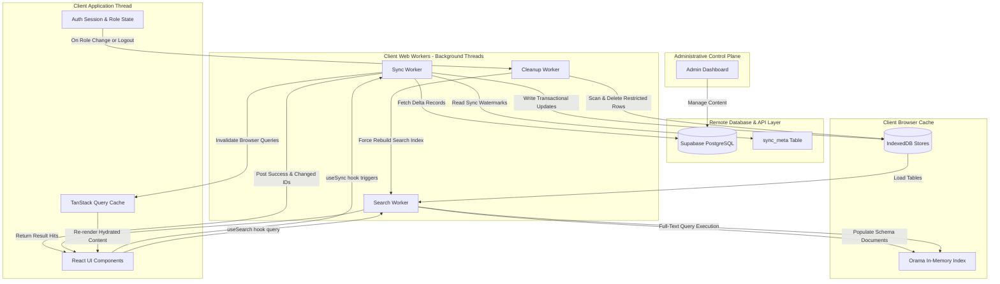

# radheshyamdas.com

Hare Krishna Hare Krishna Krishna Krishna Hare Hare
Hare Rama Hare Rama Rama Rama Hare Hare

## 1. Header & Project Overview

**radheshyamdas.com** is the high-performance public portal for accessing the spiritual discourses, audio recordings, and study materials of HG Radheshyamdas, receiving content updates synced from the corresponding administrative control plane. Built with an offline-first architecture, it synchronizes Supabase data into a local IndexedDB store and routes all full-text searches through an in-memory client-side Orama index. This setup guarantees sub-millisecond query responses and seamless content browsing even under poor or completely absent network connectivity.

### Tech Stack Matrix

| Layer / Component   | Technology                   | Specific Responsibility in Project                                                                    |
| :------------------ | :--------------------------- | :---------------------------------------------------------------------------------------------------- |
| **Framework**       | Next.js 16 (App Router)      | Core routing structure, layouts, server-side rendering, and initial page hydration.                   |
| **Language**        | TypeScript                   | Strong typing across data models, background web workers, API client interfaces, and UI props.        |
| **Database**        | Supabase (PostgreSQL)        | Remote transactional datastore storing records, metadata, user configurations, and relationships.     |
| **Security & Auth** | Supabase Auth & RLS          | Email/Google OAuth authentication; Row-Level Security rules governing access to restricted content.   |
| **Local Cache**     | IndexedDB via `idb`          | Client-side database caching normalized tables locally for offline-first querying.                    |
| **Search Engine**   | Orama (`@orama/orama`)       | Dedicated in-memory search database executing fast local full-text search and multi-criteria filters. |
| **State Caching**   | TanStack Query (React Query) | Front-end cache management, background synchronization loops, and query invalidation pipelines.       |
| **Styling & Theme** | Tailwind CSS v4 & Shadcn UI  | Utility-first component primitives supporting runtime themes (`monk`, `clean`, `dark`, `compact`).    |
| **Analytics**       | PostHog & Microsoft Clarity  | Client-side user behavior tracking and event recording.                                               |

---

## 2. Architecture & State Sync Mechanics

### System Data Flow

The following diagram illustrates how content moves from the administrative management level down to the public portal's UI layer, leveraging background worker threads to keep search and cache states in sync:



### Background Delta Synchronization

To minimize bandwidth consumption and overhead, the system implements a delta synchronization protocol running inside a dedicated worker (`src/workers/sync.ts`):

- **High-Watermark Verification**: The worker reads local timestamps from the `sync_meta` table in IndexedDB and matches them against the remote Supabase `sync_meta` watermarks.
- **Paging & Rate Limiting**: If remote tables are newer than the cached versions, records are pulled incrementally in pages of `1000` items (`SYNC_PAGE_SIZE`) using `4` concurrent requests (`SYNC_CONCURRENCY`) to prevent browser thread choking.
- **Polling Loop**: Synchronization is managed client-side by TanStack Query under the `useSync` hook, running on a recurring interval defined by `SYNC_INTERVAL` (defaulting to 5 minutes or `300000ms`).

### Smart Cache Invalidation

When database updates are committed locally during the delta sync, a targeted query invalidation pipeline triggers:

- **Recording Changes**: Modified recordings have their corresponding category IDs extracted.
- **Bubbling & Thresholds**: Recording changes bubble up to their parent categories. If the total count of modified categories is $\le 10$ (`INVALIDATE_ALL_THRESHOLD`), only those specific categories' cache keys (`[QUERY_KEY.CATEGORY_PAGE, path]`) are invalidated. If the threshold is exceeded, a global category cache invalidation is executed.
- **Lookup Updates**: If global lookup tables (such as speakers, languages, or venues) receive updates, the client forces a search worker rebuild (`WORKER_MSG.BUILD_INDEX`) and invalidates cache queries for list filters. Otherwise, it updates only specific changed documents incrementally (`WORKER_MSG.UPDATE_DOCS`).

### Role-Based Content Isolation & Cleanup

Authentication session states determine data visibility dynamically:

- **Role-Based Synchronization**: Tables with security-level constraints (`categories`, `recordings`, `materials`) sync and filter items based on the user's role identifier (`roleId`), validating values stored within the `allowed_roles` column.
- **Security Purging**: When a user logs out or changes roles, a cleanup worker (`src/workers/cleanup.ts`) immediately scans IndexedDB and deletes all rows whose `allowed_roles` do not match the new user permissions. It then terminates the existing search worker instance to delete its in-memory indices, generating a fresh, clean search engine.

### Client-Side Search Engine (Orama)

Full-text queries and filtering logic are processed entirely client-side without hitting the network via Orama search workers (`src/workers/search.ts`):

- **Orama Indexing Schemas**: Contains index layouts for `recordings` (mapping text data, language arrays, venue names, and dates), `categories` (mapping urls and category trees), and `materials` (attaching study assets to recordings).
- **Search Boosting**: Searches prioritize fields dynamically. A title match receives a boost factor of `2.0` (`SEARCH_BOOST_NAME`), and speaker names receive a boost factor of `1.5` (`SEARCH_BOOST_SPEAKER`).
- **Error Tolerance**: Query execution permits a search fuzzy tolerance of `1` (`SEARCH_TOLERANCE`) to handle spelling mistakes.
- **Target Routing**: If filter terms are active (like specific languages or dates), search targeting routes requests exclusively to the `recordings` store. If no filters are active, the engine searches across all categories, recordings, and material index tables concurrently.

---

## 3. User Settings & Volunteer Engagement

The portal provides a user profile dashboard and devotional service signup page, fully aligned with remote PostgreSQL schema definitions, triggers, and security constraints.

### Consolidated Settings & Approvals Workflow

Rather than direct updates to the `users` table or modifications to `supabase.auth` metadata (which is treated as restricted and internal), all user settings and role changes follow a strict audit trail:

- **Single Pending Request Constraint**: The database enforces that a user can have at most one pending edit request at any given time via a unique index on `user_edit_requests` (`status = 'pending'`).
- **Profile Updates**: Submitting settings updates inserts a row into `prod.user_edit_requests` with `status: 'pending'`. The main dashboard card continues to render the currently approved profile details from the `users` table.
- **Pending Alert Banner**: A dynamic warning banner surfaces at the top of the profile page detailing any active profile/role updates currently under administrative review.
- **Form Submission Lock**: The submit button transitions to a disabled state when a request is active, or if no fields have been modified from their current values ("No Changes").
- **Mentor Details**: Relationships with counselors/gurus are mapped to a structured dropdown (e.g. *Counselor / Mentor*, *Temple President / Authority*, *Spiritual Master*) with a text input fallback for custom entries.

### Automated Role Upgrades

System permissions are governed by role IDs (e.g., `1` for Admin, `2` for Student, `3` for VOICE Leader, `4` for Brahmacari, `7` for Aspiring Brahmacari, `6` for Visitor). Users do not request access levels directly; instead, their role upgrades are automatically derived and requested based on their profile settings choices:
- Ashram **Brahmacari (Monk)** -> role ID `4`
- Ashram **Aspiring Brahmacari** -> role ID `7`
- Checking **Community or VOICE Leader / Mentor** -> role ID `3`
- Ashram **Student / Youth Seeker** -> role ID `2`
- Otherwise -> role ID `6` (Visitor)

### Monastic Badge Visibility
To protect user metadata privacy, the user's role is not surfaced in the UI for low-level or public roles (`visitor`, `student`, `leader`). Role badges are rendered exclusively for restricted system roles (`admin`, `brahmacari`, `aspBrahmacari`, `manager`), displaying a warm saffron theme (`bg-[#FF9933]/15 text-[#FF9933]`) for monastic roles (`brahmacari` and `aspBrahmacari`).

### Intention-Based Volunteer Services

Volunteering opportunities for devotional services (`src/app/services/page.tsx`) measure user engagement and intention. The `user_service_interests` table restricts interest levels via check constraints, which are mapped to UI options:
- **Curious** (`'curious'`): Exploring and willing to learn.
- **Interested** (`'interested'`): Ready to contribute occasionally.
- **Committed** (`'committed'`): Ready to take regular responsibility or lead the service.

### Error Banner Surfacing
To improve accessibility and user experience, form submission errors on settings forms, contact forms, and support ticket response sections are captured via React Query/local states and rendered directly on the UI using persistent warning banners (`AlertCircle` icon) rather than depending solely on transient toast notifications.

---

## 4. Project Structure

The project follows a standard Next.js App Router structure optimized for offline synchronization and component-level co-location. All source files utilize strict `dash-case` naming.

```
src/
├── app/                        # Next.js App Router Pages & Layouts
│   ├── [...slug]/              # Dynamic category paths and recording views
│   │   └── page.tsx            # Renders dynamic categories and discourse lists
│   ├── about/                  # Static biography page
│   ├── contact-us/             # Inquiry and support contact form
│   ├── profile/                # User dashboard and session details
│   ├── services/               # Spiritual counselling and services page
│   ├── globals.css             # Tailwinds setup, CSS variables, animation and themes
│   ├── layout.tsx              # Root HTML wrapper containing layout shell structure
│   └── page.tsx                # Main homepage presenting root level categories
├── components/                 # Shared UI Components (Dash-Case)
│   ├── analytics/              # Usage tracking scripts (PostHog / Clarity)
│   ├── search/                 # Local search interface overlays and modal UI
│   ├── ui/                     # Primitives styled with Tailwind CSS (Shadcn UI)
│   ├── auth-modal.tsx          # Login and registration authentication dialog
│   ├── category-card.tsx       # Grid cards displaying categories
│   ├── category-list.tsx       # Container wrapper for rendering category structures
│   ├── footer.tsx              # Public site footer layout
│   ├── header.tsx              # Navigation bar containing account actions
│   ├── notification-center.tsx # Toast alerts and background sync status indicator
│   ├── recording-card.tsx      # Discourses, youtube links, and audio player cards
│   ├── recording-list.tsx      # Paginated and sorted lists of recordings
│   └── theme-selector.tsx      # Swaps visual style themes (monk, clean, dark, compact)
├── hooks/                      # Custom Application Hooks
│   ├── use-search.ts           # Interfaces with the background Orama search worker
│   └── use-sync.ts             # Schedules sync worker runs and invalidates query states
├── lib/                        # Standard Utility Modules
│   ├── idb.ts                  # Configures IndexedDB schemes, versions, and transactions
│   ├── supabase-browser.ts     # Instantiates the Supabase client connection
│   └── utils.ts                # Shared formatting libraries and rate-limiting utilities
├── workers/                    # Multithreaded Web Workers
│   ├── cleanup.ts              # Purges IndexedDB tables when access permissions alter
│   ├── search.ts               # Executes local fuzzy queries against Orama indices
│   └── sync.ts                 # Performs delta updates from Supabase to IndexedDB
├── constants.ts                # Action message definitions, store names, and keys
└── types.ts                    # Strong types mapped to the database schemas
```

---

## 5. Local Setup & Verification

Follow these instructions to set up the repository locally and run the public application.

### Onboarding Steps

1. **Clone the Repository**: Clone the repository files to your local workstation.
2. **Configure Environment Variables**: Duplicate the `.env` configuration file and adjust variables:
   - Ensure `NEXT_PUBLIC_SUPABASE_URL` and `NEXT_PUBLIC_SUPABASE_PUBLISHABLE_KEY` are defined.
   - Configure `SUPABASE_PROJECT_ID` locally for database type generations.
3. **Install Dependencies**: Execute the setup scripts. Always use the project-defined package manager wrapper command.
4. **Boot the Development Server**: Start the local Next.js development server.
5. **Verify codebase**: Run linting checks and test suites to verify system consistency.

### CLI Commands

All commands must be executed using the Windows-safe `pnpm.cmd` package manager interface:

- **Install dependencies**:

  ```bash
  pnpm.cmd install
  ```

- **Start the local development server**:

  ```bash
  pnpm.cmd dev
  ```

  Open `http://localhost:3000` to preview the local environment.

- **Execute test suites (Vitest)**:

  ```bash
  pnpm.cmd vitest
  ```

- **Check code styling and formatting (Biome)**:

  ```bash
  pnpm.cmd lint
  ```

- **Automatically format codebase files**:

  ```bash
  pnpm.cmd format
  ```

- **Regenerate database typescript models**:
  ```bash
  pnpm.cmd db-types
  ```
  _(Requires valid Supabase credentials in your environment files.)_
